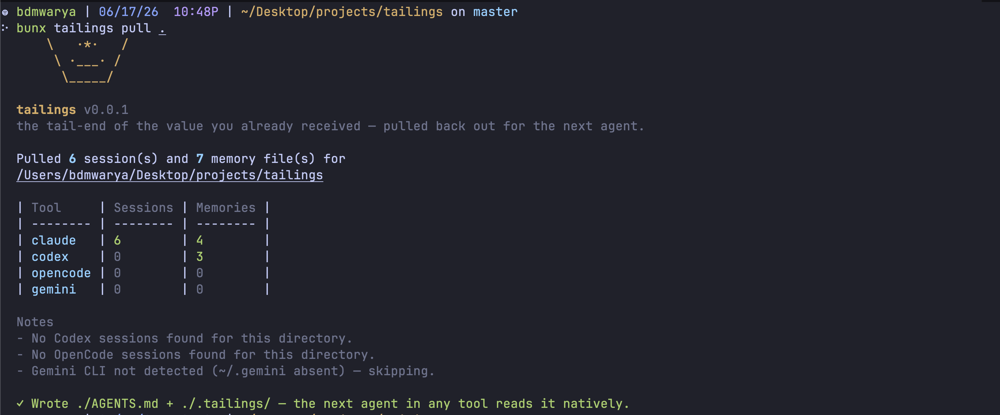

# tailings



`tailings` gathers a directory's coding-agent history — the sessions and memories that **Claude Code, Codex, OpenCode, and Gemini** produced **for that folder** — and drops them into the folder as plain text, so the next agent reads them and is instantly caught up on the prior work and decisions.

> The name is from mining: *tailings* are the material left over after the valuable ore is extracted. Here the "waste" — your pruned agent transcripts and the memories agents wrote — is the gold. The tools throw it away on a clock; this pans it back out and keeps it next to your code.

Use it when you switch agents (or hand off to a weaker one) and don't want to re-explain the project. Run `tailings pull` from a project directory and it writes a tight cross-tool digest into `./AGENTS.md` plus the full per-session transcripts and memories into `./.tailings/`. Every agent tool auto-reads `AGENTS.md` on startup, so the next agent — in any tool — picks it up natively. A weaker model with this folder beats a stronger model starting cold.

It is **per-directory, not global**: `pull` returns only the sessions whose working directory is this one (and its subdirs). It never dumps your whole chat history into a folder.

It reads local agent storage and **never modifies it**:

- **Claude Code** — `~/.claude/projects/<encoded-cwd>/<session-id>.jsonl` + per-project `memory/`
- **Codex** — `~/.codex/sessions/**/*.jsonl` + `~/.codex/memories/`
- **OpenCode** — `~/.local/share/opencode/opencode.db` + `~/.config/opencode/`
- **Gemini** — `~/.gemini/` (best-effort; skips cleanly when absent)

It only reads transcripts, stores, and their modification times. It does not edit, move, or delete anything under those directories.

## Install

Install it globally from npm if you want the `tailings` command available everywhere:

```bash
npm install --global tailings
```

Then run it from the project directory whose history you want to gather:

```bash
tailings pull
```

You can also run it without installing anything globally:

```bash
npx tailings pull
```

Or with Bun:

```bash
bunx tailings pull
```

All forms use the current working directory as the project to gather history for.

## Build

```bash
pnpm install
pnpm build
```

This bundles the CLI to `dist/cli.js` (shebang'd). From a checkout you can run it directly with `node dist/cli.js`, or `pnpm link --global` to expose the `tailings` command.

## Pull

From any project directory:

```bash
tailings pull
```

Or from this checkout without installing:

```bash
node dist/cli.js pull
```

A run gathers **only this directory's** sessions and memories from every agent tool that touched it, then:

1. Writes the full transcripts to `./.tailings/sessions/<tool>/`, one markdown file per session.
2. Co-locates the agent-written memories under `./.tailings/memories/`.
3. Splices a tight cross-tool digest into `./AGENTS.md` between `<!-- tailings:start -->` markers — never clobbering hand-written content above or below them.
4. Drops a self-ignoring `./.tailings/.gitignore` so old pasted secrets in transcripts don't get committed.

If no matching history is found, it says so for the current directory.

### Options

Restrict how far back to look (default: all):

```bash
tailings pull --since 30d            # last 30 days
tailings pull --since 2026-05-01     # since an ISO date
```

Restrict which tools to read (default: all four):

```bash
tailings pull --tools claude,codex
tailings pull --tools all
```

Print the digest to stdout instead of writing files (good for piping):

```bash
tailings pull --out -
```

Gather a directory other than the current one:

```bash
tailings pull --dir ../some-project
```

## Doctor

Check which agent stores are present on this machine:

```bash
tailings doctor
```

## Interactive

Run with no arguments to confirm, then pull the current directory:

```bash
tailings
```

## Help

Show CLI help and version (real `--help` / `--version` / shell completions, from Effect's CLI framework):

```bash
tailings -h
tailings --help
tailings --version
```

Normal use does not require any path flags; the current working directory is used automatically.

## Related tools

Companion tools that read the same local agent storage for different ends.

Looking for a *specific* lost chat to resume, rather than gathering all history into the folder? These find missing or hard-to-locate sessions that match the current directory and print the command to resume them:

- [`claude-relink`](https://github.com/WaryaWayne/claude-relink) — for Claude Code chats
- [`codex-relink`](https://github.com/WaryaWayne/codex-relink) — for Codex CLI chats

Want to see what your agents have been up to? This turns that same local history into usage analytics:

- [`ai-hr`](https://github.com/WaryaWayne/ai-hr) — local "performance reviews" for your coding agents: normalizes token usage across Claude Code, Codex, and OpenCode and generates playful report cards, leaderboards, and cost breakdowns, all from local metadata.

## Author

Built by Warya Wayne, `@waryawayne`.

- GitHub: [@WaryaWayne](https://github.com/WaryaWayne)
- X: [@waryawayne](https://x.com/waryawayne)
